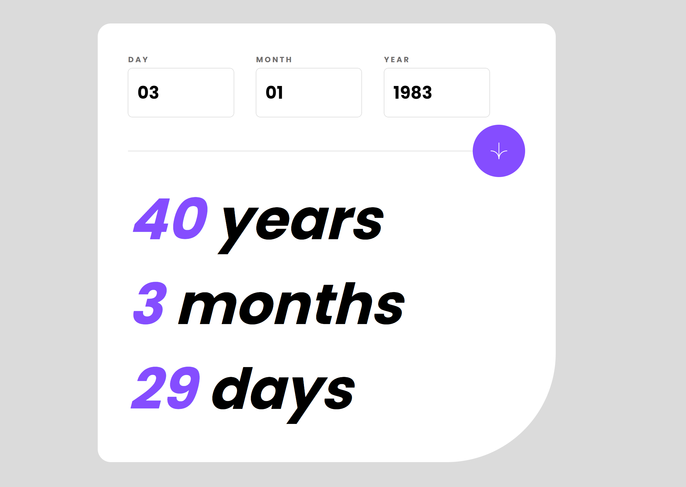

# Frontend Mentor - Age calculator app solution

This is a solution to the [Age calculator app challenge on Frontend Mentor](https://www.frontendmentor.io/challenges/age-calculator-app-dF9DFFpj-Q). Frontend Mentor challenges help you improve your coding skills by building realistic projects.

## Table of contents

- [Overview](#overview)
  - [The challenge](#the-challenge)
  - [Screenshot](#screenshot)
  - [Links](#links)
- [My process](#my-process)
  - [Built with](#built-with)
  - [What I learned](#what-i-learned)
  - [Continued development](#continued-development)
  - [Useful resources](#useful-resources)
- [Author](#author)
- [Acknowledgments](#acknowledgments)

## Overview

### The challenge

Users should be able to:

- View an age in years, months, and days after submitting a valid date through the form
- Receive validation errors if:
  - Any field is empty when the form is submitted
  - The day number is not between 1-31
  - The month number is not between 1-12
  - The year is in the future
  - The date is invalid e.g. 31/04/1991 (there are 30 days in April)
- View the optimal layout for the interface depending on their device's screen size
- See hover and focus states for all interactive elements on the page
- **Bonus**: See the age numbers animate to their final number when the form is submitted

### Screenshot



### Links

- Solution URL: [Github](https://github.com/felipeavl/age-calculator)
- Live Site URL: [Add live site URL here](https://your-live-site-url.com)

## My process

### Built with

- Semantic HTML5 markup
- CSS custom properties
- Flexbox
- Mobile-first workflow
- [React](https://reactjs.org/) - JS library
- CSS Modules

### What I learned

While working on this project, I improved my skills in building a responsive and user-friendly web application using React. I implemented form validation with helpful error messages, and I also learned how to create custom hooks and use animations in React applications.

Here's an example of the custom hook I created for animating values:

```js
import { useState, useEffect } from "react";

const useAnimatedValue = (targetValue, duration) => {
  const [animatedValue, setAnimatedValue] = useState(0);

  useEffect(() => {
    const startTime = performance.now();
    const startValue = animatedValue;

    const step = (currentTime) => {
      const elapsed = currentTime - startTime;
      const progress = Math.min(elapsed / duration, 1);
      const currentValue = startValue + (targetValue - startValue) * progress;
      setAnimatedValue(currentValue);

      if (progress < 1) {
        requestAnimationFrame(step);
      }
    };

    requestAnimationFrame(step);
  }, [targetValue, duration]);

  return animatedValue;
};
```

### Continued development

I plan to continue working on more Frontend Mentor challenges and improving my skills in React, CSS, and responsive design. I also want to explore other state management libraries and techniques, such as Redux and Context API.

### Useful resources

- [React Documentation](https://react.dev/) - The official React documentation helped me understand the fundamentals of React and its best practices.

- [CSS-Tricks](https://css-tricks.com) - CSS-Tricks is an excellent resource for learning about CSS and its various features. It helped me improve my understanding of Flexbox, media queries, and responsive design.

## Author

- Frontend Mentor - [@felipeavl](https://www.frontendmentor.io/profile/felipeavl)

## Acknowledgments

I'd like to thank the Frontend Mentor community for providing such engaging and challenging projects. These challenges have been instrumental in helping me improve my web development skills.
